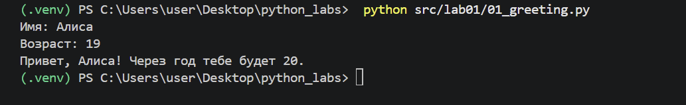
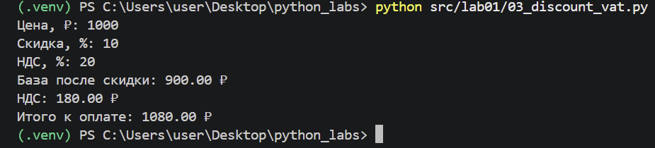
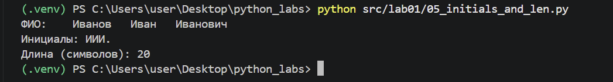
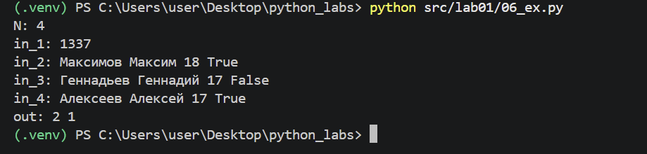
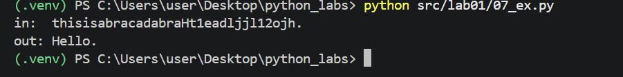

### Задание 1
```python
a=input("Имя: ")
b=int(input("Возраст: "))
print(f'Привет, {a}! Через год тебе будет {b+1}.')

```

Нечего пояснять


### Задание 2

В переменных заменить запятую на точку.При выводе сумму и среднее значение округлить до 2 знаков после запятой.
```python
a=float(input("a: ").replace(',','.'))
b=float(input("b: ").replace(',','.'))
print(f'sum={round(a+b,2)}; avg={round((a+b)/2,2)}')

```


### Задание 3

При выводе в f строке оставить 2 знака после запятой.
```python
price=float(input("Цена, ₽: "))
discount=float(input("Скидка, %: "))
vat=float(input("НДС, %: "))
base=price*(1-discount/100)
vat_amount=base*(vat/100)
total=base+vat_amount
print(f'База после скидки: {base:.2f} ₽')
print(f'НДС: {vat_amount:.2f} ₽')
print(f'Итого к оплате: {total:.2f} ₽')


```


### Задание 4

В примере при выводе не было выравнивания по двум символам,но в задании был формат ЧЧ:ММ, поэтому делала как было в задании.Для часа взять целую часть от деления на 60 и сделать выравнивание по 2 символам.Для минут взять остаток от деления на 60 и тоже выровнять по двум символам.
```python
m=int(input("Минуты: "))
print(f'{m//60:02d}:{m%60:02d}')
```


### Задание 5

Вводную переменную разбить на 3 переменные.Чтобы вывести инициалы, нужно взять первые символы этих переменных.Далее вводную переменную склеиваю и разбиваю  по пробелам.
```python
a=input("ФИО: ")
n,s,o=a.split()
m=(n[0]+s[0]+o[0]).upper()
print(f'Инициалы: {m}.')
print(f'Длина (символов): {len(' '.join(a.split()))}')

```


### Задание 6

Ввожу переменные для счета True и False.В цикле читаю числа.Делаю проверку на то,что длина должна быть 4.Затем увеличиваю счетчики,если в переменной соответствующие значения.Вывожу эти счетчики.
```python
n=int(input("N: "))
t,f=0,0
for i in range(n):
    a=input(f'in_{i+1}: ')
    a=a.split()
    if len(a)!=4:
        continue
    else:
        if a[-1]=='True':
            t+=1
        else:
            f+=1

print(f'out: {t} {f}')        

```


### Задание 7

В цикле прохожу по числу и запоминаю индекс,который являетя первой большой буквой.В другом цикле ищу первое число после индекса большой буквы и вычисляю шаг.Завожу новую переменную,где хранится индекс первой точки после индекса первого числа.Переменной, где будет хранится ответ, присваиваю первую большую букву.В цикле пробегаюсь от индекса перого числа до индекса точки с шагом и добавляю в ответ новые символы.
```python
s=input('in: ')
for i in range(len(s)):
    if s[i].isupper():
        break
    
for j in range(i,len(s)):
    if s[j] in '0123456789':
        k=j+1-i
        break
t=s[j:].find('.')+len(s[:j])
ans=s[i]
for c in range(j+1,t,k):
    ans+=s[c]
print(f'out : {ans}.')
```
    



