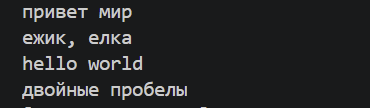
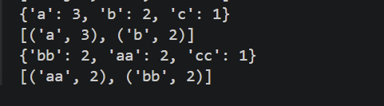
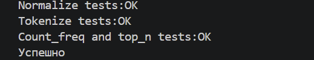
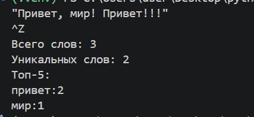
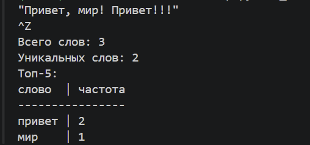

# ЛР3 - Тексты и частоты слов (словарь/множество)
---
## Задание A — src/lib/text.py
### 1.Функция-normalize
Приводит текст в нижний регистр, заменяет ё на е, удаляет спец символы и лишние пробелы.
 ```python

def normalize(text: str, *, casefold: bool = True, yo2e: bool = True) -> str:
    if casefold:
        text=text.casefold()
    if casefold==False:
        text=text.lower()
    if yo2e:
        text=text.replace('ё','е').replace('Ё','Е')
    text=text.replace('\t',' ').replace('\r',' ')
    text=text.strip()
    text=' '.join(text.split())
    return text

```

---
### 2.Функция-tokenize
С помощью регулярного выражения разделяет текст на слова, сохраняя дефисы.
 ```python
def tokenize(text: str) -> list[str]:
    pattern=r"\w+(?:-\w+)*"
    return re.findall(pattern,text)

```

---
### 3.Функции-count_freq+top_n
Count_freq считает сколько раз встретился токен. Top_n выводит n частых слов,отсортированных при равенстве частот в алфавитном порядке.
```python
def count_freq(tokens: list[str]) -> dict[str, int]:
    freq={}
    for w in tokens:
        freq[w]=freq.get(w,0)+1
    return freq

def top_n(freq: dict[str, int], n: int = 5) -> list[tuple[str, int]]:
      return sorted(freq.items(),key=lambda x: (-x[1],x[0]))[:n]

```

---
### Мини-тесты:
```python

if __name__=='__main__':
    # normalize
    assert normalize("ПрИвЕт\nМИр\t") == "привет мир"
    assert normalize("ёжик, Ёлка") == "ежик, елка"
    print('Normalize tests:OK')
    # tokenize
    assert tokenize("привет, мир!") == ["привет", "мир"]
    assert tokenize("по-настоящему круто") == ["по-настоящему", "круто"]
    assert tokenize("2025 год") == ["2025", "год"]
    print('Tokenize tests:OK')

    # count_freq + top_n
    freq = count_freq(["a","b","a","c","b","a"])
    assert freq == {"a":3, "b":2, "c":1}
    assert top_n(freq, 2) == [("a",3), ("b",2)]
    

    # тай-брейк по слову при равной частоте
    freq2 = count_freq(["bb","aa","bb","aa","cc"])
    assert top_n(freq2, 2) == [("aa",2), ("bb",2)]
    print("Count_freq and top_n tests:OK")
    print('Успешно')
```

## Задание B — src/text_stats.py 
Скрипт читает весь тескт из stdin до EOF. Вызывает функции из text.py. Далее считает общее количество слов, уникальных слов и выводит топ-5 по частоте появления. В зависимости от значения flag выводит построчно или в виде таблицы.
```python
import sys
from src.lib.text import normalize, tokenize, count_freq, top_n
flag=1
text=sys.stdin.read()
if text.strip()=='':
    raise ValueError("Пустой текст")
norm=normalize(text)
token=tokenize(norm)
cf=count_freq(token)
top=top_n(cf,n=5)
print('Всего слов:',len(token))
print('Уникальных слов:',len(set(token)))
print('Топ-5:')
if not flag:
    for t,c in top:
        print(f'{t}:{c}')
else:
    mx_sl=max(len(t) for t,c in top)
    mx=max(mx_sl,len('слово'))
    head=f'{"слово":<{mx}} | частота'
    print(head)
    print('-'*len(head))
    for t,c in top:
        print(f'{t:<{mx}} | {c}')

```
1. Обычный вывод:



2. Табличный вывод:


